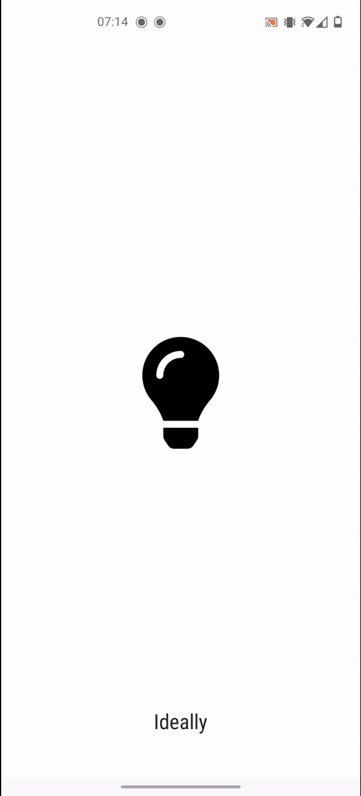
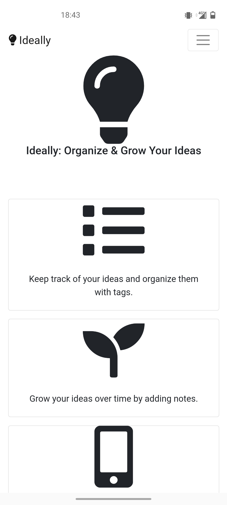
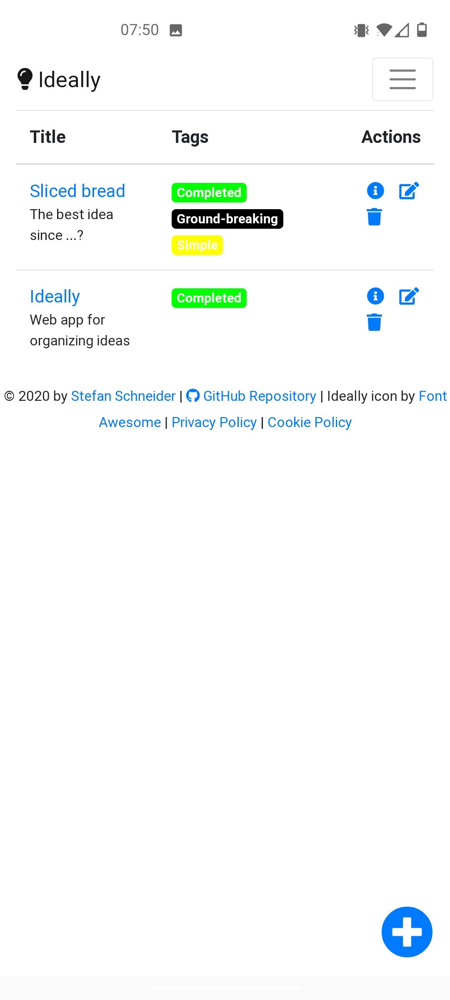
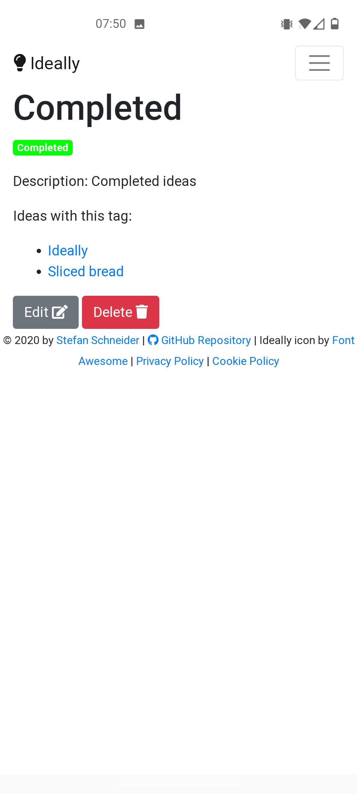
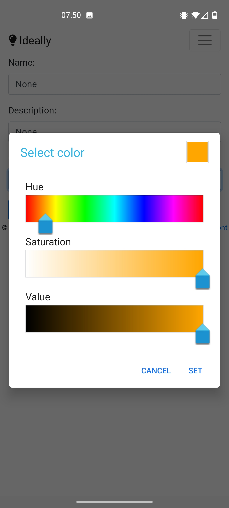

**Status:** Prototype finished. Bug fixes or minor new features may still be added.

# Ideally: Organize & Grow Your Ideas



Ideally is a progressive web app (PWA) built with Django and Bootstrap that helps you organize your ideas.

* Add new ideas and organize them with tags
* List all of your ideas or filter by tag
* Grow ideas by adding more notes
* Use anywhere: Responsive design and synced online
* User management: Register and sign in to organize your ideas securely

**Live demo:** [Heroku](https://ideally-app.herokuapp.com/)

<p float="middle">
    
    
    
    
</p>

## Usage

After creating an account, you can set up a list of ideas and tag each idea with tags.
Tags help filter similar ideas (eg, completed ideas or ideas that are important to you).
For each idea, you can also add and update a description with your thoughts.

Ideally is experimental and work in progress, so data may be lost and new features are planned.
For example, the goal is to support milestones, sets of notes, image upload, etc.

## Deployment

### Local

```
# serve
python manage.py runserver

# test
python manage.py test app
```

### Production Deployment on Heroku

Deployment is automatically updated with new pushes to `master`.

Set the following config vars in Heroku (= env vars):

* `DJANGO_SETTINGS_MODULE`: `project.prod_settings`
* `DJANGO_SECRET_KEY`: `<randomly-generated-secret-key>`
* `DATABASE_URL`: URL to Heroku Postgres DB
* `SENDGRID_API_KEY`: `<sendgrid-api-key>`

For serving static files (e.g., favicon) in production, Ideally uses `whitenoise`.

## Limitations

* Image upload: Image upload is supported but disabled (commented out) since it doesn't work on Heroku without AWS S3

## Todos

* WIP: add milestones, notes to ideas (see inline todos and fixmes)
* PWA: https://github.com/silviolleite/django-pwa
    * fixme: doesn't show add to home screen
* search, sort, filter ideas based on tags and create/update time (with Vue.js?)
* improve usability by asking others what to improve

